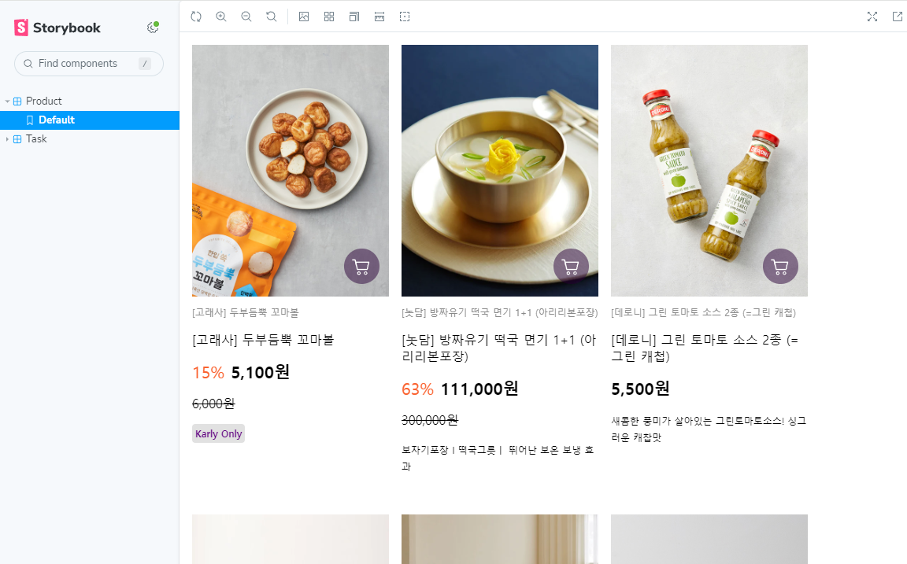

# React-Homework 2

## 1. 바닐라 프로젝트때의 일부분을 리액트 컴포넌트로 리스트 렌더링하기
> [페이지 링크 이동](https://sang-react2.netlify.app/)


### 1. 과제 주제
> 바닐라 프로젝트의 일부분인 상품 카드를 리액트의 리스트 렌더링으로 구성해보고자 했다.

### 2. 코드 작성 과정

1) 과제 스케폴딩
---
- `yarn` 사용
- `storybook` 사용
- `TypeScript` 사용
- `vite` 사용
- `netlify`를 이용해 배포

2) Storybook 튜토리얼
---
- https://storybook.js.org/tutorials/intro-to-storybook/react/ko/get-started/
- 튜토리얼 페이지를 참고해 `Task` 컴포넌트를 먼저 등록해보았다.
```ts
/* Task.tsx */
import React from 'react';

export interface taskProps {
  task: {id:string, title: string, state: string};
  onArchiveTask?: string;
  onPinTask?: string;
}

const Task: React.FunctionComponent<taskProps> = ({ 
  task: {id, title}, 
  onArchiveTask, 
  onPinTask }) => {
  return (
    <div className="list-item">
      <input type="text" value={title} readOnly={true} />
    </div>
  )
}


export default Task;
```

3) Product 컴포넌트 제작
---
- `product`의 데이터는 프로젝트때의 포켓베이스 데이터를 console로 찍어 얻게 된 자료를 사용했다.
- 각 배경 이미지의 주소는 포켓베이스 api를 사용한 이미지 주소 호출 방식을 사용했는데.. 문제가 있었다.
> netlify에 배포 후 알게 된 사실인데... 셀프 호스팅 포켓베이스를 사용하다보니 ssl이 적용되지 않은 http를 사용하게 되어<br />
> https로 호스팅되는 netlify에서 mix-content 에러때문에 이미지가 모두 깨지는 현상이 발생했었다..<br />
> apache에 ssl을 적용하는 방법이 꽤나 복잡하고 귀찮아서 우선은 프로젝트 때 사용했던 포켓베이스 주소로 바꾸어 배포했다.

```ts
/* Product.tsx */
export interface productProps {
  id: string,
  collectionId: string,
  product_name: string,
  product_img: string,
  brand_id?: string,
  price: number,
  discount?: number,
  product_description: string,
  karly_only?: number,
  limit?: number,
  category_id: string[],
  collectionName: string,
  created: string,
  delivery_type: string,
  etc?: object,
  packaging_type: string,
  product_detail_img: string,
  updated: string
}

const Product = (product: productProps) => {

  return (
  <li className='product'>
    <a href="#">
      <Thumbnail {...product} />
      {product.brand_id && <p className="brand_id">{product.product_name}</p>}
      <p className="title">{product.product_name}</p>
      <Price {...product} />
      <span className="description">{product.product_description}</span>
      <Keyword {...product}/>
    </a>
  </li>  

  )
}
```

4) `Products`에서 `Product`를 `Array.map`으로 렌더링
---
- Product를 뿌려주기 위한 Products 컴포넌트를 만들어 각각 렌더링하도록 구성했다.
```ts
import productsData from '../data/products.json';
import Product, {productProps} from './product';

const Products = () => {
  
  return (
    <ul style={{
      margin: 0,
      padding: 0,
      display: "flex",
      gap: "16px",
      flexFlow: "row wrap"
    }}>
      {
        productsData.map((product:productProps) => (
          <Product key={product.id} {...product}/>
        ))
      }
    </ul>
  )
}

export default Products;
```

5) `Product` 컴포넌트를 `Storybook`로 전달
- 튜토리얼 Task와 마찬가지로 Product.stories.tsx를 생성해 Storybook으로 전달했다.
 


### 3. 마치며
---
> 앞으로의 리액트 수업에서 타입스크립트를 사용하고자 연습하는 겸 타입스크립트로 과제를 도전해봤다.<br />
> 어쩌다 보니 storybook의 바람이 불어넣어져 storybook 스케폴딩으로 시작을 해버리는 바람에 타입스크립트의 설정에 많이 애먹고 포기한 부분이 꽤 많았다. <br />
> 수업에 본격적으로 들어갈 때는 딱 타입스크립트만 사용해서 연습해야겠다고 생각했다.<br />
> 질의응답에 몇 가지 질문을 올리고 싶은게 있었는데 Storybook 설정과 충돌나서 안되는 부분이 분명히 있으리라... 생각하고 이후에 생기는대로 모두 올려볼 생각이다!!
